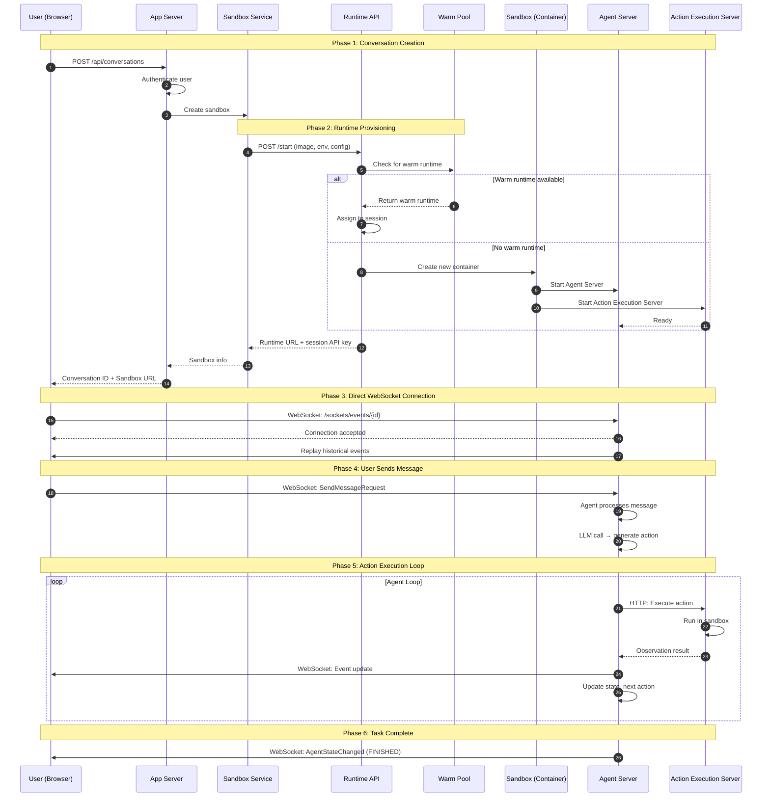

# Conversation Startup & WebSocket Flow

When a user starts a conversation, this sequence occurs:

### Key Points

1. **Initial Setup via App Server**: The App Server handles authentication and coordinates with the Sandbox Service
2. **Runtime API Provisioning**: The Sandbox Service calls the Runtime API, which checks for warm runtimes before creating new containers
3. **Warm Pool Optimization**: Pre-warmed runtimes reduce startup latency significantly
4. **Direct WebSocket to Sandbox**: Once created, the user's browser connects **directly** to the Agent Server inside the sandbox
5. **App Server Not in Hot Path**: After connection, all real-time communication bypasses the App Server entirely
6. **Agent Server Orchestrates**: The Agent Server manages the AI loop, calling the Action Execution Server for actual command execution
