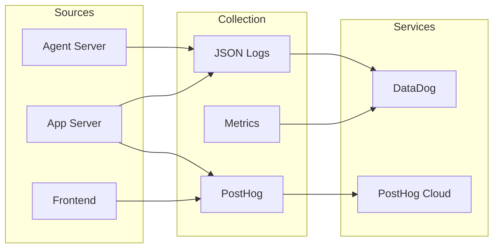

# Metrics, Logs & Observability

OpenHands uses multiple systems for monitoring, analytics, and debugging:



### Logging Infrastructure

| Component | Format | Destination | Purpose |
|-----------|--------|-------------|---------|
| **Application Logs** | JSON (when `LOG_JSON=1`) | stdout → DataDog | Debugging, error tracking |
| **Access Logs** | JSON (Uvicorn) | stdout → DataDog | Request tracing |
| **LLM Debug Logs** | Plain text | File (optional) | LLM call debugging |

### JSON Log Format

When `LOG_JSON=1` is set, all logs are emitted as single-line JSON for DataDog ingestion:

```json
{
  "message": "Conversation started",
  "severity": "INFO",
  "conversation_id": "abc-123",
  "user_id": "user-456",
  "timestamp": "2024-01-15T10:30:00Z"
}
```

### Metrics Tracked

| Metric | Tracked By | Storage | Purpose |
|--------|------------|---------|---------|
| **LLM Cost** | `Metrics` class | Conversation stats file | Billing, budget limits |
| **Token Usage** | `Metrics` class | Conversation stats file | Usage analytics |
| **Response Latency** | `Metrics` class | Conversation stats file | Performance monitoring |
| **User Events** | PostHog | PostHog Cloud | Product analytics |
| **Feature Flags** | PostHog | PostHog Cloud | Gradual rollouts |

### PostHog Analytics

PostHog is used for both product analytics and feature flags:

**Frontend Events:**
- `conversation_started`
- `download_trajectory_button_clicked`
- Feature flag checks

**Backend Events:**
- Experiment assignments
- Conversion tracking

### DataDog Integration

Logs are ingested by DataDog through structured JSON output:

1. **Log Collection**: Container stdout/stderr → DataDog Agent → DataDog Logs
2. **APM Traces**: Distributed tracing across services (when enabled)
3. **Dashboards**: Custom dashboards for:
   - Error rates by service
   - Request latency percentiles
   - Conversation success rates
   - LLM cost tracking

### Conversation Stats Persistence

Per-conversation metrics are persisted for billing and analytics:

```python
# Location: openhands/server/services/conversation_stats.py
ConversationStats:
  - service_to_metrics: Dict[str, Metrics]
  - accumulated_cost: float
  - token_usage: TokenUsage

# Stored at: {file_store}/conversation_stats/{conversation_id}.pkl
```
