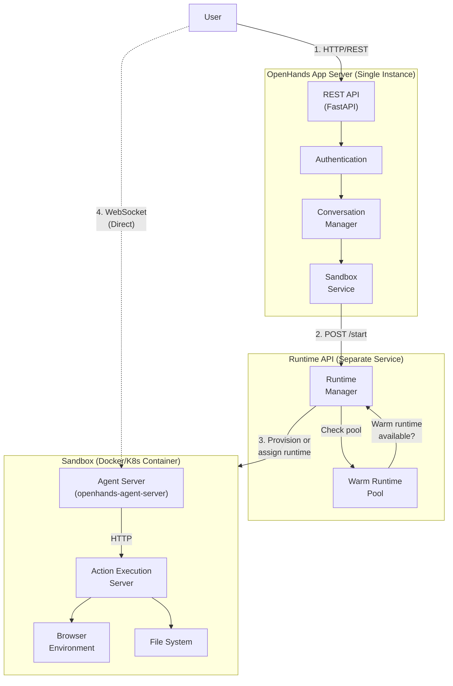

# System Architecture Overview

OpenHands uses a multi-tier architecture with these main components:

### Component Responsibilities

| Component | Location | Instances | Purpose |
|-----------|----------|-----------|---------|
| **App Server** | Host | 1 per deployment | REST API, auth, conversation management |
| **Sandbox Service** | Inside App Server | 1 | Manages sandbox lifecycle, calls Runtime API |
| **Runtime API** | Separate service | 1 per deployment | Provisions runtimes, manages warm pool |
| **Agent Server** | Inside sandbox | 1 per sandbox | AI agent loop, LLM calls, state management |
| **Action Execution Server** | Inside sandbox | 1 per sandbox | Execute bash, file ops, browser actions |

### Runtime API Endpoints

The Runtime API manages the actual container/pod lifecycle:

| Endpoint | Purpose |
|----------|---------|
| `POST /start` | Start a new runtime (or assign from warm pool) |
| `POST /stop` | Stop and clean up a runtime |
| `POST /pause` | Pause a running runtime |
| `POST /resume` | Resume a paused runtime |
| `GET /sessions/{id}` | Get runtime status |
| `GET /list` | List all active runtimes |
